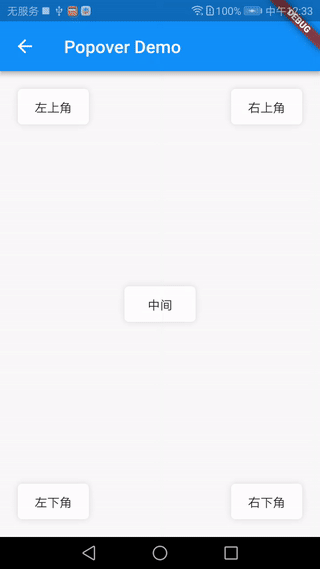
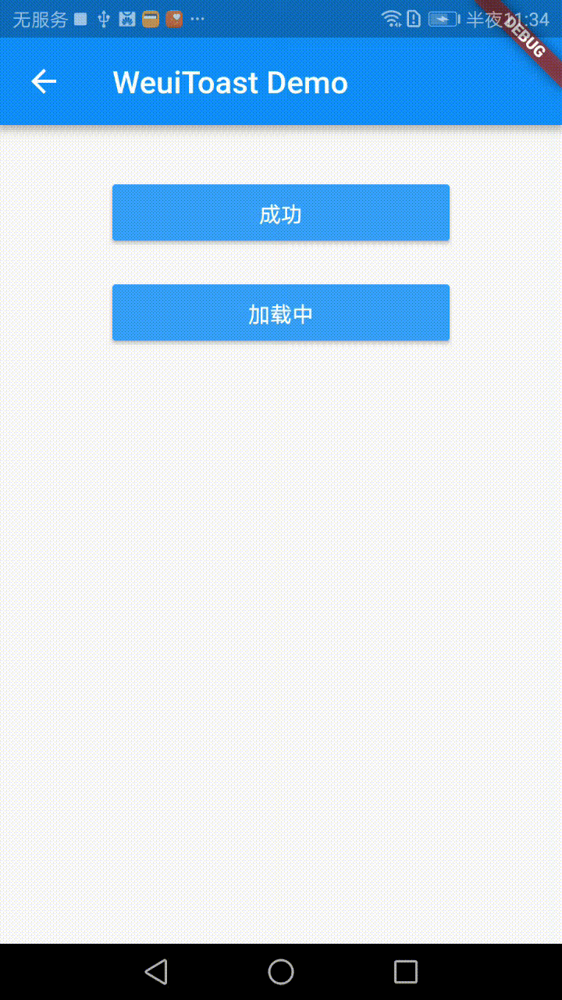

# cool_ui [](https://pub.dartlang.org/packages/cool_ui)

用flutter实现一些我认为好看的UI控件,有觉得好看的UI控件可以提出来,我会考虑实现,

Usage
Add this to your package's pubspec.yaml file:
``` yaml
dependencies:
  cool_ui: "^0.1.4"
```

# 控件

- [CupertinoPopoverButton](#CupertinoPopoverButton)
- [CupertinoPopoverMenuList](#CupertinoPopoverMenuList)
- [CupertinoPopoverMenuItem](#CupertinoPopoverMenuItem)
- [showWeuiToast](#showWeuiToast)
- [showWeuiSuccessToast](#showWeuiSuccessToast)
- [showWeuiLoadingToast](#showWeuiLoadingToast)


## CupertinoPopoverButton
仿iOS的UIPopover效果的

用于弹窗的按钮
```dart
CupertinoPopoverButton({
    this.child,
    this.popoverBuild,
    this.popoverColor=Colors.white,
    @required this.popoverWidth,
    @required this.popoverHeight,
    this.onTap,
    this.transitionDuration=const Duration(milliseconds: 200),
    this.radius=8.0});
```


| Param | Type | Default | Description |
| --- | --- | --- | --- |
| child | <code>Widget</code> |  | 按钮的内容 |
| popoverBuild | <code>WidgetBuilder</code> |  | 生成弹出框的内容 |
| popoverWidth | <code>double</code> |  | 弹出框的宽度 |
| popoverHeight | <code>double</code> |  | 弹出框的高度 |
| [onTap] | <code>BoolCallback</code> |  | 按钮点击事件,返回true取消默认反应(不打开Popover) |
| [popoverColor] | <code>Color</code> | 白色 | 弹出框的背景颜色 |
| [transitionDuration] | <code>Duration</code> | 0.2s  | 过度动画时间 |
| [radius] | <code>double</code> |  8.0 | 弹出框的圆角弧度 |


**Example**

```dart
CupertinoPopoverButton(
        child: Container(
          margin: EdgeInsets.all(20.0),
          width: 80.0,
          height: 40.0,
          decoration: BoxDecoration(
              color: Colors.white,
              borderRadius: BorderRadius.all(Radius.circular(5.0)),
              boxShadow: [BoxShadow(color: Colors.black12,blurRadius: 5.0)]
          ),
          child: Center(child:Text('左上角')),
        ),
        popoverBuild:(BuildContext context){
              return  Container(
                          width: 100.0,
                          height: 100.0,
                          child: Text('左上角内容'),
                        )
        },
        popoverWidth: 100.0,
        popoverHeight: 100.0);
```



## CupertinoPopoverMenuList
Popover弹出的菜单样式列表,一般与[CupertinoPopoverMenuItem](#CupertinoPopoverMenuItem)一起用,会给两个Item加间隔线
```dart
CupertinoPopoverMenuList({this.children})
```
| Param | Type | Description |
| --- | --- | --- |
| children | <code>List<Widget></code>  | 子元素,一般是CupertinoPopoverMenuItem |


## CupertinoPopoverMenuItem
单个菜单项

```dart
const CupertinoPopoverMenuItem({
    this.leading,
    this.child,
    this.onTap,
    this.isTapClosePopover=true
  });
```
| Param | Type |  Description |
| --- | --- | --- |
| [leading] | <code>Widget<Widget></code>  | 菜单左边,一般放图标 |
| [child] | <code>Widget<Widget></code>  | 菜单内容 |
| [onTap] | <code>BoolCallback</code> |  | 按钮点击事件,返回true取消默认反应(不关闭Popover) |
| [isTapClosePopover] | <code>bool<Widget></code>  | 是否点击关闭 |

#### 案例核心代码
```dart
    CupertinoPopoverMenuList(
                    children: <Widget>[
                      CupertinoPopoverMenuItem(leading: Icon(Icons.add),child: Text("新增"),),
                      CupertinoPopoverMenuItem(leading: Icon(Icons.edit),child: Text("修改"),),
                      CupertinoPopoverMenuItem(leading: Icon(Icons.delete),child: Text("删除"),)
                    ],
                  )
```


## showWeuiToast
仿Weui的Toast效果
```dart
VoidCallback showWeuiToast({
  @required BuildContext context,
  @required Widget message,
  @required Widget icon,
  RouteTransitionsBuilder transitionBuilder})
```
| Param | Type | Description |
| --- | --- | --- |
| [context] | <code>BuildContext<Widget></code>  | 上下文 |
| [message] | <code>Widget<Widget></code>  | 提示消息 |
| [icon] | <code>Widget<Widget></code>  | 图标 |
| [transitionBuilder] | <code>RouteTransitionsBuilder<Widget></code>  | 自定义过度动画 |

返回参数:VoidCallback,用于关闭Toast




## showWeuiSuccessToast
仿Weui的SuccessToast效果
```dart
Future showWeuiSuccessToast({
  @required BuildContext context,
  @required Widget message=const Text("成功"),
  RouteTransitionsBuilder transitionBuilder,
  Duration closeDuration = const Duration(seconds: 3)
  })
```
| Param | Type | Default | Description |
| --- | --- | --- | --- |
| [context] | <code>BuildContext<Widget></code>  | | 上下文 |
| [transitionBuilder] | <code>RouteTransitionsBuilder<Widget></code>  | | 自定义过度动画 |
| [message] | <code>Widget<Widget></code> | 成功| 提示消息 |
| [closeDuration] | <code>Duration<Widget></code>  | 3s | 关闭时间 |

返回参数:Future dart 异步操作,代表Toast已关闭


## showWeuiLoadingToast
仿Weui的LoadingToast效果
```dart
VoidCallback showWeuiToast({
  @required BuildContext context,
  @required Widget message,
  RouteTransitionsBuilder transitionBuilder
  })
```
| Param | Type | Description |
| --- | --- |  --- |
| [context] | <code>BuildContext<Widget></code>  | 上下文 |
| [message] | <code>Widget<Widget></code> | 提示消息 |
| [transitionBuilder] | <code>RouteTransitionsBuilder<Widget></code> | 自定义过度动画 |

返回参数:VoidCallback,用于关闭Toast
